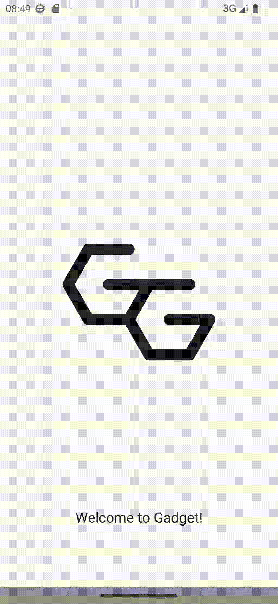

# gadget-theme

> 简单易用的Android App 主题换肤框架。



## 添加依赖

- 借助`gadgets`(推荐)：

  1. 添加classpath

     ```kotlin
     /**
      * root project build.gradle.kts
      */
     buildscript {
         dependencies {
             // gradle script.
             classpath("com.github.Zhupff.gadgets:gadget-theme:xxx")
             // theme-resource pack&merge&inject.
             classpath("com.github.Zhupff.gadgets:theme-plugin:xxx")
         }
     }
     ```

  2. 启用功能

     ```kotlin
     /**
      * Application module build.gradle.kts
      */
     gadgets {
         Theme {
             // add merge-plugin.
             themeMerge()
             // add theme-function dependencies.
             theme()
         }
     }
     ```

  3. 皮肤资源打包

     ```kotlin
     /**
      * theme-resource module build.gradle.kts
      */
     gadgets {
         Theme {
             // add pack-plugin.
             themePack()
        }
     }
     ```

  4. 皮肤资源注入

     ```kotlin
     /**
      * theme-resource module build.gradle.kts
      */
     gadgets {
         Theme {
             // add inject-plugin.
             themeInject(originPrefix = "xxx", injectPrefix = "xxx")
        }
     }
     ```

     

- 不借助`gadgets`

  1. 添加classpath

     ```kotlin
     /**
      * root project build.gradle.kts
      */
     buildscript {
         dependencies {
             // theme-resource pack&merge&inject.
             classpath("com.github.Zhupff.gadgets:theme-plugin:xxx")
         }
     }
     plugins {
         id("zhupff.gadgets.theme.merge") version "xxx" apply false
         id("zhupff.gadgets.theme.pack") version "xxx" apply false
         id("zhupff.gadgets.theme.inject") version "xxx" apply false
     }
     ```
  
  2. 启用功能
  
     ```kotlin
     /**
      * Application module build.gradle.kts
      */
     plugins {
         // add merge-plugin.
         id("zhupff.gadgets.theme.merge")
     }
     dependencies {
         // add theme-function dependencies.
         implementation("com.github.Zhupff.gadgets:theme:xxx")
     }
     ```
     
  3. 皮肤资源打包（选用）
  
     ```kotlin
     /**
      * theme-resource module build.gradle.kts
      */
     plugins {
         // add pack-plugin
         id("zhupff.gadgets.theme.pack")
     }
     ```
     
  4. 皮肤资源注入（选用）
  
     ```kotlin
     /**
      * theme-resource module build.gradle.kts
      */
     plugins {
         // add inject-plugin
         id("zhupff.gadgets.theme.inject")
     }
     themeInject {
         prefix = "xxx"
         variant = "xxx"
     }
     ```

## 功能使用

  ### 换肤框架

  1. 声明默认主题（即默认使用的主题资源）

     实现一个`Theme`实例：

     ```kotlin
     val ORIGIN_THEME = ResourceTheme(
         "origin", // 这个主题的名字，需要是唯一的
         null, // 默认主题没有父主题
         Application.resources, // 使用Application里的resources
     )
     ```
     
  2. 自定义`ThemeConfig`

     ```kotlin
     open class YourThemeConfig(
         /**
          * 主题资源的前缀(如：<color name="theme__primary_color">#FFFFFFFF</color>)，
          * prefix就是"theme__"，其他用于换肤的资源也需要带有这个前缀，
          * 后续inflate的时候会根据用到的资源是否带有该前缀，来判断这个View的这个属性是否需要换肤。
          */
         val prefix: String,
         /**
          * 项目中所有自定义换肤属性
          */
         val attributes: List<ThemeAttribute>,
     )
     
     /**
      * 下面简单举个ThemeAttribute的例子
      * 这里我借用AutoService汇总所有的ThemeAttribute给ThemeConfig，
      * 可以根据项目实际情况使用自己的方式
      */
     @AutoService(ThemeAttribute::class)
     class Background @JvmOverloads constructor(
         resourceID: Int = ResourcesCompat.ID_NULL,
     ) : ThemeAttribute("background", resourceID) {
         override fun apply(view: View, theme: Theme) {
             if (resourceType == TYPE_COLOR) {
                 val color = theme.getColor(resourceId) ?: return
                 if (color is ColorStateList) {
                     view.setBackgroundColor(color.defaultColor)
                 } else if (color is Int) {
                     view.setBackgroundColor(color)
                 }
             } else if (resourceType == TYPE_DRAWABLE) {
                 val drawable = theme.getDrawable(resourceId)
                 view.background = drawable
             }
         }
     }
     ```
     
  3. 替换`LayoutInflator.Factory`

     ```kotlin
     class MainActivity : AppCompatActivity {
         override fun onCreate(savedInstanceState: Bundle?) {
             layoutInflater.factory2 = ThemeFactory(
                 layoutInflater.factory2, // 可以理解为用默认的factory兜底
                 YourThemeConfig(),
             )
             super.onCreate(savedInstanceState)
         }
     }
     ```

  4. 声明主题分发

     一个view对象会使用view-tree上层距离最近的分发者分发的主题：

     ```
     Activity(dispatch theme A)
         |--- View(use theme A)
         |--- ViewGroup(dispatch theme B)
         |        |--- View (use theme B)
         |--- Fragment(dispatch theme C)
                  |--- View (use theme C)
     ```

     - 通过Activity分发

       ```kotlin
       class MainActivity : AppCompatActivity, ThemeDispacter {
           override fun observableTheme(): LiveData<Theme> {
               // implement by yourself.
           }
       }
       ```

     - 通过View分发

       ```kotlin
       class YourView : FrameLayout, ThemeDispacter {
           override fun observableTheme(): LiveData<Theme> {
               // implement by yourself.
           }
       } 
       ```

     使用者可以通过在不同的Activity或页面的view实现各自层级的主题分发，比较常见在一些“主题试用”的功能。

  5. 以上便完成了换肤框架的接入。

  ### 主题资源包

主题资源包本质上是一个“只包含资源的apk”文件，里面的资源都能且必须能在app中找到对应的一样名字的同类型资源，比如：

```xml
<!-- orgin theme in app -->
<color name="theme__primary_color">#FFFFFFFF</color>)

<!-- other theme in themepack -->
<color name="theme__primary_color">#FF000000</color>)
```

比如你的app默认是明亮主题，想增加一个黑暗主题，可以按照以下步骤产出资源包：

1. 在项目中新增一个`Application module`，里面仅包含资源文件，不包含任何代码

2. 在这个module的`assets`目录添加一个`theme.json`文件，内容必须包含一条声明这个module的`package name`的`theme_id`，后续运行时会用这个theme_id，也就相当于resources里的packagename去拿资源（可按需扩展）

   ```json
   {
     "theme_id": "zhupff.gadget.theme.dark"
   }
   ```

3. assemble，生成的apk文件就是可用的资源包，后续可以通过网络或其他方式下载到本地进行加载即可。

4. （可选）如果想随着APP一起打包发布（比如常用主题希望随时能用到），可以在这个资源module的`build.gradle`使用`pack-plugin`（见上面的添加依赖），这样主题资源包便会一起打包进Apk中的`assets/themepacks`下，后续可以在运行时通过`Application.resources.assets`导出到设备。

   > 注：使用pack-plugin时需要确保主项目app module同时使用了merge-plugin，且主项目不需要对资源module使用依赖，pack-plugin会在主项目编译时先一步打包并自动加入到主项目的打包任务里。

获取到主题资源包的文件后，需要拿到文件里的Resources，ResourceTheme提供了一个简单实现：（当然也可以使用其他方法，只要能拿到Resources就行）：

```kotlin
open class ResourceTheme {
    companion object {
        @JvmStatic
        fun loadResources(filePath: String): Resources? {
            return try {
                val assetManager = AssetManager::class.java.newInstance()
                val addAssetPath = assetManager::class.java.getDeclaredMethod("addAssetPath", String::class.java)
                addAssetPath.invoke(assetManager, filePath)
                Resources(assetManager, APPLICATION.resources.displayMetrics, APPLICATION.resources.configuration)
            } catch (e: Exception) {
                e.printStackTrace()
                null
            }
        }
    }
}
```

拿到Resources之后便可以创建主题实例了：

```kotlin
val darkThemeResources = ResourceTheme.loadResources(filePath)
val darkTheme = ResourceTheme(
    name = "dark",
    parent = ORIGIN_THEME, // 非默认主题需要一个父主题，在自身资源有缺省的时候会向父主题查找
    resources = darkThemeResources,
)
```

这里解释下使用`ORIGIN_THEME`做参数的意义：

1. 每个主题实例（默认主题除外）都必须有一个`parent`主题，所有主题实例的最老的祖宗都必须是ORIGIN_THEME。

2. 代码中使用到的资源id都是基于ORIGIN_THEME.resources的，所以不同主题实例之间需要通过ORIGIN_THEME建立联系，以确保资源映射的正确性。

3. 当主题资源包缺少某个资源（比如一个色值、一张图片或一个字符串），那么在切换该主题找不到这个资源的时候，就会往上查找`parent`主题中对应的资源，如果一直找不到，则最终会回到ORIGIN_THEME中拿到默认资源。

   这样可以一定程度上减少主题资源包的体积，比如某个主题只在默认的基础上有几张背景图不同，那么该主题资源包可以只打包这几张图，其余的资源可以复用默认资源。

### 主题资源注入

有些时候我不想单独给主题资源打包，就是想和默认资源一起发布的话怎么办呢？

> 大部分app都支持明亮和黑暗两套主题，如果把黑暗主题当成资源包在运行时再加载，会需要一定的时间，如果把黑暗主题的资源也一起打进apk里，就可以跳过独立加载这一过程，达到即时响应的效果。

可以通过`inject-plugin`（见上文添加依赖）将单独的资源module里的资源文件，在主项目的编译打包开始之前，拷贝到主项目中参与后续的打包，大体流程如下：

1. 在资源module的`build.gradle`下使用`inject-plugin`，并声明`prefix`和`variant`，其中`prefix`是主题资源的前缀（比如前面的`theme__`），而`variant`则是资源变体的声明（比如`variant=dark`），需要是唯一的。
2. 主项目开始编译前，资源module会遍历它所有资源文件并进行以下处理：
   1. 如果文件是`.xml`文件，会修改里面的内容，把`prefix`替换成`variantprefix`（比如`theme__` -> `darktheme__`）
   2. 如果文件是以`prefix`开头的，会重命名为`variantprefix`（比如`theme__drawable.xml` -> `darktheme__drawable`）
   3. 过滤掉所有不以`prefix`开头且非`.xml`的文件（因为作为一个资源包，这样的文件没有意义）。
   4. 过滤后的资源会被拷贝到主项目的`build/themeinjects/xxxx`目录下面
3. 主项目编译开始，`build/themeinjects/xxx`目录下的资源会参与构建，最终生成的apk里就会带有dark主题的资源了。

> Q：为什么要这么麻烦？干脆开发的时候就把资源加入主项目不就好了吗？
>
> A：主要是为了对开发者无感，试想如果项目里存在一个`theme__drawable.xml`和一个`darktheme__drawable.xml`，那么在开发时，有可能开发者就直接使用了`darktheme__drawable.xml`，这样最终运行时就没有主题切换的效果了，那么为了避免开发者误敲这行代码，最好的办法就是把`darktheme__drawable.xml`资源独立出来，在构建时再自动添加进去。
>
> Q：为什么需要`variant`字段？
>
> A：主要是为了避免资源重名，这么说大家应该就都理解了吧

### 样例

```xml
<!-- main_activity.xml -->
<?xml version="1.0" encoding="utf-8"?>
<FrameLayout xmlns:android="http://schemas.android.com/apk/res/android"
    android:layout_width="match_parent"
    android:layout_height="match_parent">

    <TextView
        android:id="@+id/tv"
        android:layout_width="wrap_content"
        android:layout_height="wrap_content"
        android:layout_gravity="center"
        android:text="Hello Gadget!"
        android:textColor="@color/theme__themeColor"
        android:background="@drawable/logo"/>

</FrameLayout>
```

一眼过去是不是没看出有什么特别的地方？？？

确实和寻常编写没有任何区别，不需要增加xmlns也不需要增加tag，只需要在资源命名上花点功夫就行了（通常开发时对于换肤资源本来就要特殊化管理，所以这点功夫应该不算什么，属于常规内容）。

所以，只有那句`android:textColor="@color/theme__themeColor"`，因为我们声明了`textColor`的ThemeAttribute（见上文）同时资源名带有我们声明的前缀`theme__`，所以在切换主题的时候，这个TextView的文字颜色也会发生相应改变，其他的属性不受影响。

  